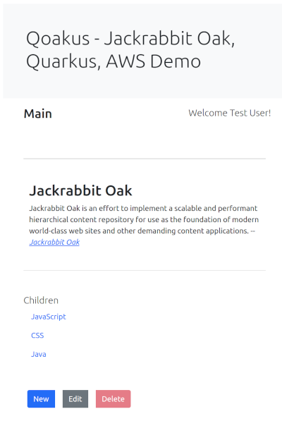
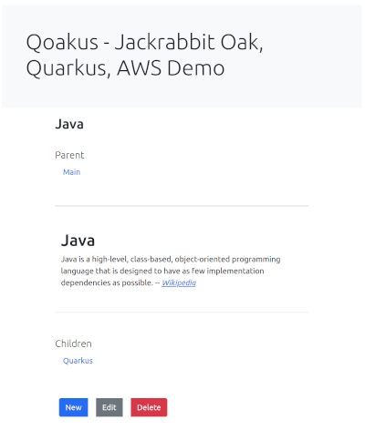

# Qoakus

An Apache Jackrabbit Oak reference web application with an AWS backend running on Quarkus.

## Features

### View
Examine JCR node properties and related nodes. Binary file nodes containing Markdown are rendered in the browser.



#### Hierarchical Navigation
Navigate up and down the JCR node hierarchy.



#### Tika Preview
Binary file nodes can be previewed using Apache Tika. Note that document formats will not be fully preserved as Tika is intended to be used primarily for content indexing and not full fidelity document conversion rendering.


### Edit

#### Markdown Editor
A Javascript Markdown editor is used to manage Markdown binary JCR files inside the browser.


#### Image Upload

Images can be dragged and dropped onto the Markdown editor or manually uploaded.

#### Attachment Upload

File attachments can be uploaded and stored as binary JCR file nodes.

#### Outlook Drag and Drop

Email messages from the Windows Outlook client can be dragged and dropped to the mailbox icon and they will be automatically uploaded as binary JCR file nodes. The messages will be stored in the Outlook propriety .msg format but they can be previewed via Tika. The Outlook web application will not drop a full binary file but it does drop metadata that could be used retrieve the binary message from Outlook using the Microsoft Graph API.

## Security

### External Identity Provider

A Jackrabbit Oak [External Identity Provider](http://jackrabbit.apache.org/oak/docs/security/authentication/externalloginmodule.html) with credentials support for [Quarkus JWT tokens](https://quarkus.io/guides/security-openid-connect) is included for OIDC SSO. Edit the [application.properties](src/main/resources/application.properties) to configure and enable this feature.

### ACL
A group, qoakus-general, is automatically created and assigned full permissions to all JCR root nodes except for a protected one defined for demonstration purposes.

### User Management
The [ResourceManager.java](src/main/java/com/github/aaronanderson/qoakus/RepositoryManager.java) class includes API calls for creating users and groups and assigning permissions to them.


## AWS

### AWS CLI

Install the [AWS CLI tool](https://docs.aws.amazon.com/cli/latest/userguide/install-cliv2.html). Run `aws configure` to set the access and secret keys in the local environment and make them available to the Qoakus application when it runs.

```
aws configure
AWS Access Key ID [********************]:
AWS Secret Access Key [********************]:
Default region name [us-east-1]:
Default output format [None]:
```

### Custom Node Segment

The [oak-segment-aws](https://github.com/apache/jackrabbit-oak/tree/trunk/oak-segment-aws) plugin is used to permanently persist JCR nodes in the Cloud. If no AWS configurations are present in the application.properties file the JCR repository will be created using in-memory storage.


#### Setup

Update the [application.properties](src/main/resources/application.properties) file and provide values for the qoakus.aws properties. The `qoakus.aws.filestore-path` property is optional since nothing gets written to it due to the custom persistence configuration and a temporary directory will be used if a value is not provided.

Jackrabbit Oak will automatically create the specified S3 bucket and DynamoDB tables if they do not exists. Take special care when setting these values and starting the Quarkus application for the first time.

### Elasticsearch

Create a new Elasticsearch domain in AWS.

`aws es create-elasticsearch-domain --domain-name qoakus --elasticsearch-version 7.9 --elasticsearch-cluster-config InstanceType=t2.small.elasticsearch,InstanceCount=1,DedicatedMasterEnabled=false,ZoneAwarenessEnabled=false --ebs-options EBSEnabled=true,VolumeType=gp2,VolumeSize=10`

In the AWS console go to Elasticsearch Service, click on the link to the qoakus domain, and copy the Endpoint value. Next on the domain select Actions -> Modify access policy, leave the default JSON defined access policy, and then past in the following JSON:

```
{
  "Version": "2012-10-17",
  "Statement": [
    {
      "Effect": "Allow",
      "Principal": {
        "AWS": "*"
      },
      "Action": "es:*",
      "Resource": "arn:aws:es:us-west-1:XXXXXXXXXXX:domain/qoakus/*",
      "Condition": {
        "IpAddress": {
          "aws:SourceIp": "XXX.XXX.XXX.XXX"
        }
      }
    }
  ]
}

```

Change the region if needed and replace the X values with numeric AWS account number and your local IP address respectively. Applying this policy will whitelist your IP and allow you to connect to the domain without authentication. The AWS CLI only supports the AWS management aspect of Elasticsearch and there is no universal standard CLI took available.

The Jackrabbit Oak async index update process will dynamically create new Elasticsearch indexes as they are configured in Oak.

List all of the Elasticsearch indexes:

`curl -X GET https://search-qoakus-XXXXXXXXXXXXXXXX.us-west-1.es.amazonaws.com/_cat/indices`

List all of the Elasticsearch aliases:

`curl -X GET https://search-qoakus-XXXXXXXXXXXXXXXX.us-west-1.es.amazonaws.com/_cat/aliases`


View the index configuration for specific Oak index:

`curl -X GET https://search-qoakus-XXXXXXXXXXXXXXXX.us-west-1.es.amazonaws.com/oak-elastic._qoglobalsearch?pretty=true`

View the documents in a specific index:

`curl -X GET https://search-qoakus-XXXXXXXXXXXXXXXX.us-west-1.es.amazonaws.com/oak-elastic._qoglobalsearch/_search?pretty=true`

### Cleanup

```
aws s3 rm --recursive s3://XXXXXXXXX-jackrabbit-oak/oak;
aws dynamodb delete-table --table-name JackrabbitOak-Journal;
aws dynamodb delete-table --table-name JackrabbitOak-Lock;
curl -X DELETE https://search-qoakus-XXXXXXXXXXXXXXXX.us-west-1.es.amazonaws.com/oak-elastic*;
```


## Build and Run

Build the application:

`mvn clean install`

Run the application in Quarkus devmode:

`mvn quarkus:dev`

The application will be available at `http://localhost:5000`

While Quarkus is running the Snowpack devserver can run concurrently for real-time TypeScript updates:

`yarn start`

The application will be available at `http://localhost:8080`

To run Quarkus in production mode start the runner jar:

`java -jar target/quarkus-app/quarkus-run.jar`


## Maintenance

TBD

[Jackrabbit Oak CLI](http://jackrabbit.apache.org/oak/docs/command_line.html)

`mvn dependency:copy -Dartifact="org.apache.jackrabbit:oak-run:RELEASE:jar" -Dmdep.stripVersion -DoutputDirectory=/tmp/`

`java -jar /tmp/oak-run.jar export`
