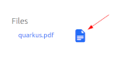

# Qoakus

An [Apache Jackrabbit Oak](https://jackrabbit.apache.org/oak/) reference web application with an AWS backend running on [Quarkus](https://quarkus.io/).

## Features

### View
Examine JCR node properties and related nodes. Binary file nodes containing Markdown are rendered in the browser.


#### Hierarchical Navigation
Navigate up and down the JCR node hierarchy.


#### Tika Preview
Binary file nodes can be previewed using Apache Tika. Note that document formats will not be fully preserved as Tika is intended to be used primarily for content indexing and not full fidelity document conversion rendering.



### Edit

#### Markdown Editor
A Javascript Markdown editor is used to manage Markdown binary JCR files inside the browser.


#### Image Upload

Images can be dragged and dropped onto the Markdown editor or manually uploaded.

#### Attachment Upload

File attachments can be uploaded and stored as binary JCR file nodes.

#### Outlook Drag and Drop

Email messages from the Windows Outlook client can be dragged and dropped to the mailbox icon and they will be automatically uploaded as binary JCR file nodes. The messages will be stored in the Outlook propriety .msg format but they can be previewed via Tika. The Outlook web application will not drop a full binary file but it does drop metadata that could be used retrieve the binary message from Outlook using the Microsoft Graph API.

## Security

### External Identity Provider

A Jackrabbit Oak [External Identity Provider](http://jackrabbit.apache.org/oak/docs/security/authentication/externalloginmodule.html) with credentials support for [Quarkus JWT tokens](https://quarkus.io/guides/security-openid-connect) is included for OIDC SSO. Edit the [application.properties](src/main/resources/application.properties) to configure and enable this feature.

### ACL
A group, qoakus-general, is automatically created and assigned full permissions to all JCR root nodes except for a protected one defined for demonstration purposes.

### User Management
The [ResourceManager.java](src/main/java/com/github/aaronanderson/qoakus/RepositoryManager.java) class includes API calls for creating users and groups and assigning permissions to them.

## Limitation
| :exclamation:  Apache Oak Jackrabbit Guava version Workaround  |
|----------------------------------------------------------------|

[OAK-7182 - Make it possible to update Guava](https://issues.apache.org/jira/browse/OAK-7182) is still an open issue to refactor Oak to reduce dependencies on Guava and allow applications that embed Oak to use more recent versions of Guava. While much progress has been made and Oak is fully functional with the latest version of Guava using Segment Node Store (see the aws_standalone branch) the Document Store implementation is older and still has a few references to obsolete Guava methods. Rather than attempting to fork Oak and apply and maintain patches this application uses ASM to perform light Java bytecode modifications and correct the Guava method call signatures so that the application can depend on published versions of Oak and run without error.

The modification of the bytecode and placement of the resulting class files in the target/classes directory works fine for Quarkus production mode where the application is bundled together into JAR files but in Quarkus devMode there is a problem with class hot reloading. DevMode will throw an exception if a class in the target/classes directory is attempted to be loaded because the Quarkus devMode framework and extensions should hot reload all class files upon modification. Instead of building an elaborate multi-module Quarkus extension a check is made in the application to see if Quarkus is running in devMode and if so the QuarkusClassLoader is hacked through Java reflection to load the modified classes from the desired directory.

Once OAK-7182 progresses far enough to use the latest version of Guava without issue all of these workarounds can be removed.


## AWS

### Considerations

Currently Jackrabbit Oak only supports [clustering](http://jackrabbit.apache.org/oak/docs/clustering.html) with MongoDB and RDBMS SQL. Support for clustered node storage may be possible in the [future](https://issues.apache.org/jira/browse/OAK-7932).  Having a single instance of Oak along with [Direct Binary Access](http://jackrabbit.apache.org/oak/docs/features/direct-binary-access.html) may be sufficient for limited deployments.If so please review the [aws_standalone](https://github.com/aaronanderson/qoakus/tree/aws_standalone) branch.


### AWS CLI

Install the [AWS CLI tool](https://docs.aws.amazon.com/cli/latest/userguide/install-cliv2.html). Run `aws configure` to set the access and secret keys in the local environment and make them available to the Qoakus application when it runs.

```
aws configure
AWS Access Key ID [********************]:
AWS Secret Access Key [********************]:
Default region name [us-east-1]:
Default output format [None]:
```

### RDB DocumentStore

The [oak-segment-aws](http://jackrabbit.apache.org/oak/docs/nodestore/document/rdb-document-store.html) plugin is used to permanently persist JCR nodes in a SQL RDBMS. This example application uses [AWS Aurora](https://aws.amazon.com/rds/aurora)

#### AWS Aurora

Run this command to create a new AWS network security group. Replace vpc-xxxxxx with the default VPC id for the region. Go to the VPC service and select "Your VPCs" to identify the default value.  Record the group ID when the group is created. The last command provides an IP whitelist into the VPC network. Leave the /32 suffix for a single IP value.
`aws ec2 create-security-group --description "Qoakus RDS Network Rules" --vpc-id vpc-xxxxxxxx --group-name  qoakus
aws ec2 create-tags --tags Key=Name,Value=qoakus --resources sg-xxxxxxxxxxxxxxxxx
aws ec2 authorize-security-group-ingress --group-id sg-xxxxxxxxxxxxxxxxx --protocol tcp --port 3306 --cidr XXX.XXX.XXX.XXX/32
`

Run the following commands to create a new Aurora database cluster. Specify a strong password and include the appropriate VPC and network security group IDs.

```
aws rds create-db-cluster \
--db-cluster-identifier qoakus-cluster \
--engine aurora-mysql \
--engine-version 5.7.mysql_aurora.2.10.0 \
--master-username qoadmin \
--master-user-password xxxxxxxxxxxx \
--db-subnet-group-name default \
--vpc-security-group-ids sg-xxxxxxxxxxxxxxxxx \
--enable-iam-database-authentication

```

Run the following command to create a database instance.

```
aws rds create-db-instance \
    --db-instance-class db.t3.small \
    --db-instance-identifier qoakus-instance \
    --engine aurora-mysql  \
    --db-cluster-identifier qoakus-cluster

```
Enable public access to the DB instance. The security group inbound/ingress rules IP whitelisting still apply and password authentication is still needed so the instance is not wide open. In a production environment where an application is deployed to ECS and is stable consider  disabling public access (--no-publicly-accessible) so only internal AWS access is allowed.

`aws rds modify-db-instance --db-instance-identifier qoakus-instance --publicly-accessible`

After the instance is created run the command

`aws rds describe-db-instances --filters "Name=engine,Values=aurora-mysql"  --query "*[].[DBInstanceIdentifier,Endpoint.Address,Endpoint.Port,MasterUsername]"`

and capture the instance's endpoint information including the address and port.

Install the mysql client if needed:

`sudo apt-get install mysql-client`

Connect to the database:


`mysql -h qoakus-instance.xxxxxxxxxxxxx.us-west-1.rds.amazonaws.com -P 3306 -u qoadmin -p`

enter the qoadmin password.

Create the Oak database:

`create database oak DEFAULT CHARACTER SET utf8mb4 COLLATE utf8mb4_unicode_ci; exit;`

Optionally create a login configuration file for promptless authentication:

`mysql_config_editor set --login-path=qoakus --host=qoakus-instance.xxxxxxxxxxxx.us-west-1.rds.amazonaws.com --port=3306 --user=qoadmin --password`

`mysql --login-path=qoakus`

#### TLS (Optional)

| :exclamation:  TLS Performance may be poor outside of the AWS datacenter and with a minimal RDS instance class.  |
|------------------------------------------------------------------------------------------------------------------|

Unless it is required leave TLS off.

To enable TLS on the JDBC connection between the application and AWS RDS set the following [application.properties](src/main/resources/application.properties):

```
quarkus.datasource.jdbc.additional-jdbc-properties.useSSL=true
quarkus.datasource.jdbc.additional-jdbc-properties.enabledTLSProtocols=TLSv1.2
```

AWS RDS use self signed certificates that have root CAs not typically found in the default JDK cacerts. This application will register a custom X509TrustManager that will load the AWS certs from the classpath if database TLS is enabled.

Download the [AWS certificate bundile](https://docs.aws.amazon.com/AmazonRDS/latest/UserGuide/UsingWithRDS.SSL.html) for the region the database is hosted in. Follow the [MySQL](https://dev.mysql.com/doc/connector-j/5.1/en/connector-j-reference-using-ssl.html) SSL guide and perform the following command:

`keytool -importcert -alias aws-rds -file ~/Downloads/us-west-1-bundle.pem  -keystore src/main/resources/truststore.jks -storepass qoakus`

Restart the application.

### Elasticsearch (Optional)

Create a new Elasticsearch domain in AWS.

`aws es create-elasticsearch-domain --domain-name qoakus --elasticsearch-version 7.9 --elasticsearch-cluster-config InstanceType=t2.small.elasticsearch,InstanceCount=1,DedicatedMasterEnabled=false,ZoneAwarenessEnabled=false --ebs-options EBSEnabled=true,VolumeType=gp2,VolumeSize=10`

In the AWS console go to Elasticsearch Service, click on the link to the qoakus domain, and copy the Endpoint value. Next on the domain select Actions -> Modify access policy, leave the default JSON defined access policy, and then past in the following JSON:

```
{
  "Version": "2012-10-17",
  "Statement": [
    {
      "Effect": "Allow",
      "Principal": {
        "AWS": "*"
      },
      "Action": "es:*",
      "Resource": "arn:aws:es:us-west-1:XXXXXXXXXXX:domain/qoakus/*",
      "Condition": {
        "IpAddress": {
          "aws:SourceIp": "XXX.XXX.XXX.XXX"
        }
      }
    }
  ]
}

```

Change the region if needed and replace the X values with numeric AWS account number and your local IP address respectively. Applying this policy will whitelist your IP and allow you to connect to the domain without authentication. The AWS CLI only supports the AWS management aspect of Elasticsearch and there is no universal standard CLI took available.

The Jackrabbit Oak async index update process will dynamically create new Elasticsearch indexes as they are configured in Oak.

List all of the Elasticsearch indexes:

`curl -X GET https://search-qoakus-XXXXXXXXXXXXXXXX.us-west-1.es.amazonaws.com/_cat/indices`

List all of the Elasticsearch aliases:

`curl -X GET https://search-qoakus-XXXXXXXXXXXXXXXX.us-west-1.es.amazonaws.com/_cat/aliases`


View the index configuration for specific Oak index:

`curl -X GET https://search-qoakus-XXXXXXXXXXXXXXXX.us-west-1.es.amazonaws.com/oak-elastic._qocontent?pretty=true`

View the documents in a specific index:

`curl -X GET https://search-qoakus-XXXXXXXXXXXXXXXX.us-west-1.es.amazonaws.com/oak-elastic._qocontent/_search?pretty=true&size=100`

#### Application Configuration

Update the [application.properties](src/main/resources/application.properties) file and provide values for the qoakus.aws and quarkus.datasource properties.

Jackrabbit Oak will automatically create the specified S3 bucket, RDS database tables, and Elasticsearch index if they do not exists. Take special care when setting these values and starting the Quarkus application for the first time.


### Cleanup

During development it may be desirable to remove all of the existing Oak AWS service configurations so that they can be re-created using new settings. For instance, testing new Oak index configurations. Run the commands below before restarting the application to remove all data stored in AWS.  

```
aws s3 rm --recursive s3://XXXXXXXXX-jackrabbit-oak/oak;
mysql --login-path=qoakus -e "drop database oak";
mysql --login-path=qoakus -e "create database oak DEFAULT CHARACTER SET utf8mb4 COLLATE utf8mb4_unicode_ci";
curl -X DELETE https://search-qoakus-XXXXXXXXXXXXXXXX.us-west-1.es.amazonaws.com/oak-elastic*;
```


## Build and Run

Build the application:

`mvn clean install`

Run the application in Quarkus devmode:

`mvn quarkus:dev`

The application will be available at `http://localhost:5000`

While Quarkus is running the Snowpack devserver can run concurrently for real-time TypeScript updates:

`yarn start`

The application will be available at `http://localhost:8080`

To run Quarkus in production mode start the runner jar:

`java -jar target/quarkus-app/quarkus-run.jar`


## Maintenance

TBD

[Jackrabbit Oak CLI](http://jackrabbit.apache.org/oak/docs/command_line.html)

`mvn dependency:copy -Dartifact="org.apache.jackrabbit:oak-run:RELEASE:jar" -Dmdep.stripVersion -DoutputDirectory=/tmp/`

`java -jar /tmp/oak-run.jar export`
